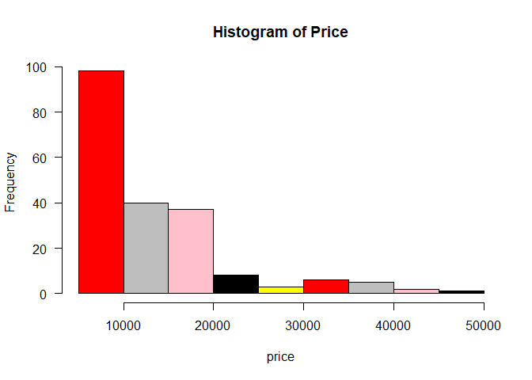
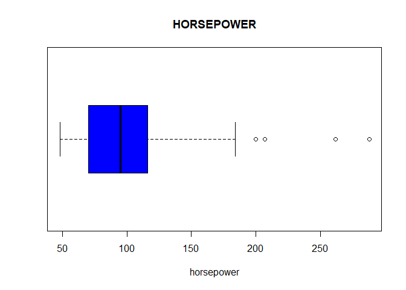
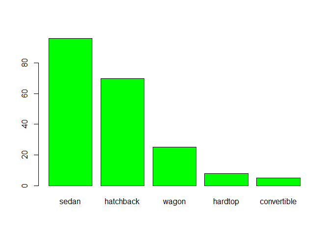
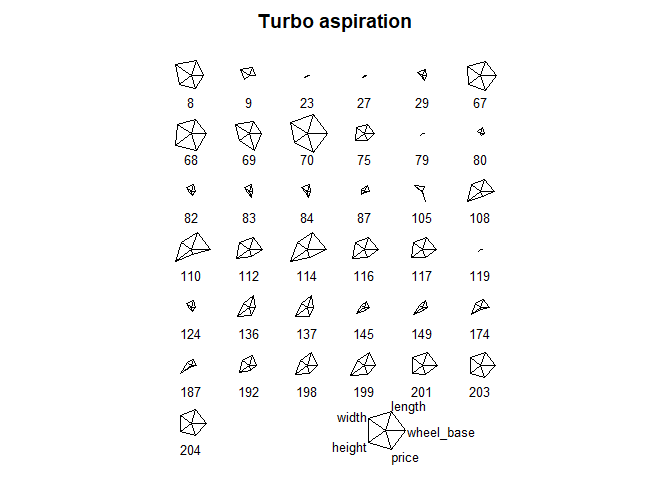
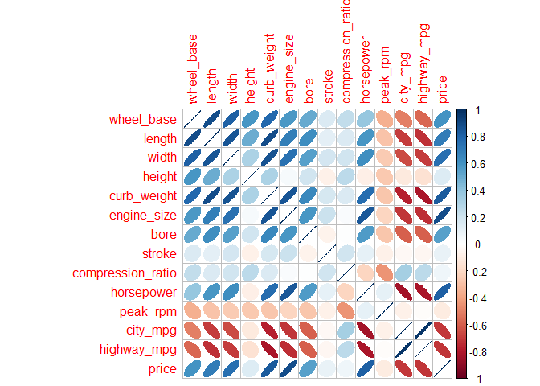
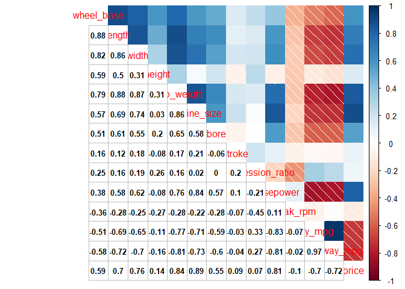
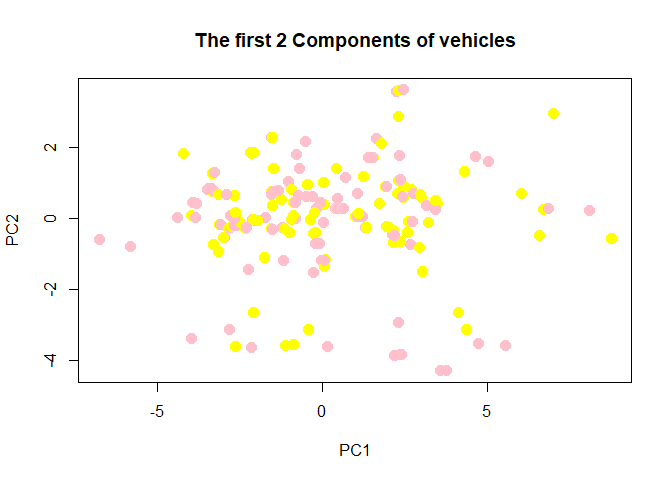
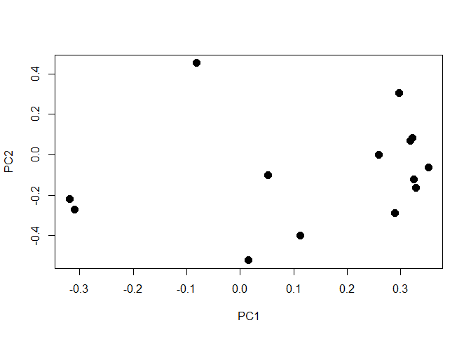
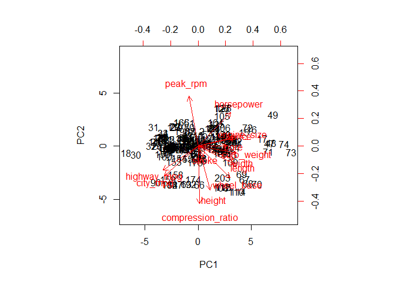

hw01-Minjeong-Jeong
================
Minjeong Jeong
2018년 2월 20일

``` r
library(corrplot)
```

    ## corrplot 0.84 loaded

``` r
library(MASS)
```

2.Data import
=============

``` r
column_names <- c('symboling',
                  'normalized_losses',
                  'make',
                  'fuel_type',
                  'aspiration',
                  'num_of_doors',
                  'body_style',
                  'drive_wheels',
                  'engine_location',
                  'wheel_base',
                  'length',
                  'width',
                  'height',
                  'curb_weight',
                  'engine_type',
                  'num_of_cylinders',
                  'engine_size',
                  'fuel_system',
                  'bore',
                  'stroke',
                  'compression_ratio',
                  'horsepower',
                  'peak_rpm',
                  'city_mpg',
                  'highway_mpg',
                  'price'
                  )
```

``` r
#importing using read.csv
dat<- read.csv('imports-85.data',
                  col.names=column_names,na.strings='?',header=TRUE,
                  colClasses= c(symboling='real',
                  normalized_losses="real",
                  make="character",
                  fuel_type="character",
                  aspiration="character",
                  num_of_doors="character",
                  body_style="character",
                  drive_wheels="character",
                  engine_location="character",
                  wheel_base='real',
                  length='real',
                  width='real',
                  height='real',
                  curb_weight='integer',
                  engine_type="character",
                  num_of_cylinders="character",
                  engine_size='integer',
                  fuel_system="character",
                  bore="real",
                  stroke="real",
                  compression_ratio='real',
                  horsepower='integer',
                  peak_rpm='integer',
                  city_mpg='integer',
                  highway_mpg='integer',
                  price='integer'))
str(dat)
```

    ## 'data.frame':    204 obs. of  26 variables:
    ##  $ symboling        : num  3 1 2 2 2 1 1 1 0 2 ...
    ##  $ normalized_losses: num  NA NA 164 164 NA 158 NA 158 NA 192 ...
    ##  $ make             : chr  "alfa-romero" "alfa-romero" "audi" "audi" ...
    ##  $ fuel_type        : chr  "gas" "gas" "gas" "gas" ...
    ##  $ aspiration       : chr  "std" "std" "std" "std" ...
    ##  $ num_of_doors     : chr  "two" "two" "four" "four" ...
    ##  $ body_style       : chr  "convertible" "hatchback" "sedan" "sedan" ...
    ##  $ drive_wheels     : chr  "rwd" "rwd" "fwd" "4wd" ...
    ##  $ engine_location  : chr  "front" "front" "front" "front" ...
    ##  $ wheel_base       : num  88.6 94.5 99.8 99.4 99.8 ...
    ##  $ length           : num  169 171 177 177 177 ...
    ##  $ width            : num  64.1 65.5 66.2 66.4 66.3 71.4 71.4 71.4 67.9 64.8 ...
    ##  $ height           : num  48.8 52.4 54.3 54.3 53.1 55.7 55.7 55.9 52 54.3 ...
    ##  $ curb_weight      : int  2548 2823 2337 2824 2507 2844 2954 3086 3053 2395 ...
    ##  $ engine_type      : chr  "dohc" "ohcv" "ohc" "ohc" ...
    ##  $ num_of_cylinders : chr  "four" "six" "four" "five" ...
    ##  $ engine_size      : int  130 152 109 136 136 136 136 131 131 108 ...
    ##  $ fuel_system      : chr  "mpfi" "mpfi" "mpfi" "mpfi" ...
    ##  $ bore             : num  3.47 2.68 3.19 3.19 3.19 3.19 3.19 3.13 3.13 3.5 ...
    ##  $ stroke           : num  2.68 3.47 3.4 3.4 3.4 3.4 3.4 3.4 3.4 2.8 ...
    ##  $ compression_ratio: num  9 9 10 8 8.5 8.5 8.5 8.3 7 8.8 ...
    ##  $ horsepower       : int  111 154 102 115 110 110 110 140 160 101 ...
    ##  $ peak_rpm         : int  5000 5000 5500 5500 5500 5500 5500 5500 5500 5800 ...
    ##  $ city_mpg         : int  21 19 24 18 19 19 19 17 16 23 ...
    ##  $ highway_mpg      : int  27 26 30 22 25 25 25 20 22 29 ...
    ##  $ price            : int  16500 16500 13950 17450 15250 17710 18920 23875 NA 16430 ...

``` r
#importing using read_csv
library(readr)
dat1 <- read_csv('imports-85.data',col_names =column_names,na='?',
                  col_types = list(symboling=col_double(),
                  normalized_losses=col_double(),
                  make=col_character(),
                  fuel_type=col_character(),
                  aspiration=col_character(),
                  num_of_doors=col_character(),
                  body_style=col_character(),
                  drive_wheels=col_character(),
                  engine_location=col_character(),
                  wheel_base=col_double(),
                  length=col_double(),
                  width=col_double(),
                  height=col_double(),
                  curb_weight=col_integer(),
                  engine_type=col_character(),
                  num_of_cylinders=col_character(),
                  engine_size=col_integer(),
                  fuel_system=col_character(),
                  bore=col_double(),
                  stroke=col_double(),
                  compression_ratio=col_double(),
                  horsepower=col_integer(),
                  peak_rpm=col_integer(),
                  city_mpg=col_integer(),
                  highway_mpg=col_integer(),
                  price=col_integer()
                  ))
str(dat1)              
```

    ## Classes 'tbl_df', 'tbl' and 'data.frame':    205 obs. of  26 variables:
    ##  $ symboling        : num  3 3 1 2 2 2 1 1 1 0 ...
    ##  $ normalized_losses: num  NA NA NA 164 164 NA 158 NA 158 NA ...
    ##  $ make             : chr  "alfa-romero" "alfa-romero" "alfa-romero" "audi" ...
    ##  $ fuel_type        : chr  "gas" "gas" "gas" "gas" ...
    ##  $ aspiration       : chr  "std" "std" "std" "std" ...
    ##  $ num_of_doors     : chr  "two" "two" "two" "four" ...
    ##  $ body_style       : chr  "convertible" "convertible" "hatchback" "sedan" ...
    ##  $ drive_wheels     : chr  "rwd" "rwd" "rwd" "fwd" ...
    ##  $ engine_location  : chr  "front" "front" "front" "front" ...
    ##  $ wheel_base       : num  88.6 88.6 94.5 99.8 99.4 ...
    ##  $ length           : num  169 169 171 177 177 ...
    ##  $ width            : num  64.1 64.1 65.5 66.2 66.4 66.3 71.4 71.4 71.4 67.9 ...
    ##  $ height           : num  48.8 48.8 52.4 54.3 54.3 53.1 55.7 55.7 55.9 52 ...
    ##  $ curb_weight      : int  2548 2548 2823 2337 2824 2507 2844 2954 3086 3053 ...
    ##  $ engine_type      : chr  "dohc" "dohc" "ohcv" "ohc" ...
    ##  $ num_of_cylinders : chr  "four" "four" "six" "four" ...
    ##  $ engine_size      : int  130 130 152 109 136 136 136 136 131 131 ...
    ##  $ fuel_system      : chr  "mpfi" "mpfi" "mpfi" "mpfi" ...
    ##  $ bore             : num  3.47 3.47 2.68 3.19 3.19 3.19 3.19 3.19 3.13 3.13 ...
    ##  $ stroke           : num  2.68 2.68 3.47 3.4 3.4 3.4 3.4 3.4 3.4 3.4 ...
    ##  $ compression_ratio: num  9 9 9 10 8 8.5 8.5 8.5 8.3 7 ...
    ##  $ horsepower       : int  111 111 154 102 115 110 110 110 140 160 ...
    ##  $ peak_rpm         : int  5000 5000 5000 5500 5500 5500 5500 5500 5500 5500 ...
    ##  $ city_mpg         : int  21 21 19 24 18 19 19 19 17 16 ...
    ##  $ highway_mpg      : int  27 27 26 30 22 25 25 25 20 22 ...
    ##  $ price            : int  13495 16500 16500 13950 17450 15250 17710 18920 23875 NA ...
    ##  - attr(*, "spec")=List of 2
    ##   ..$ cols   :List of 26
    ##   .. ..$ symboling        : list()
    ##   .. .. ..- attr(*, "class")= chr  "collector_double" "collector"
    ##   .. ..$ normalized_losses: list()
    ##   .. .. ..- attr(*, "class")= chr  "collector_double" "collector"
    ##   .. ..$ make             : list()
    ##   .. .. ..- attr(*, "class")= chr  "collector_character" "collector"
    ##   .. ..$ fuel_type        : list()
    ##   .. .. ..- attr(*, "class")= chr  "collector_character" "collector"
    ##   .. ..$ aspiration       : list()
    ##   .. .. ..- attr(*, "class")= chr  "collector_character" "collector"
    ##   .. ..$ num_of_doors     : list()
    ##   .. .. ..- attr(*, "class")= chr  "collector_character" "collector"
    ##   .. ..$ body_style       : list()
    ##   .. .. ..- attr(*, "class")= chr  "collector_character" "collector"
    ##   .. ..$ drive_wheels     : list()
    ##   .. .. ..- attr(*, "class")= chr  "collector_character" "collector"
    ##   .. ..$ engine_location  : list()
    ##   .. .. ..- attr(*, "class")= chr  "collector_character" "collector"
    ##   .. ..$ wheel_base       : list()
    ##   .. .. ..- attr(*, "class")= chr  "collector_double" "collector"
    ##   .. ..$ length           : list()
    ##   .. .. ..- attr(*, "class")= chr  "collector_double" "collector"
    ##   .. ..$ width            : list()
    ##   .. .. ..- attr(*, "class")= chr  "collector_double" "collector"
    ##   .. ..$ height           : list()
    ##   .. .. ..- attr(*, "class")= chr  "collector_double" "collector"
    ##   .. ..$ curb_weight      : list()
    ##   .. .. ..- attr(*, "class")= chr  "collector_integer" "collector"
    ##   .. ..$ engine_type      : list()
    ##   .. .. ..- attr(*, "class")= chr  "collector_character" "collector"
    ##   .. ..$ num_of_cylinders : list()
    ##   .. .. ..- attr(*, "class")= chr  "collector_character" "collector"
    ##   .. ..$ engine_size      : list()
    ##   .. .. ..- attr(*, "class")= chr  "collector_integer" "collector"
    ##   .. ..$ fuel_system      : list()
    ##   .. .. ..- attr(*, "class")= chr  "collector_character" "collector"
    ##   .. ..$ bore             : list()
    ##   .. .. ..- attr(*, "class")= chr  "collector_double" "collector"
    ##   .. ..$ stroke           : list()
    ##   .. .. ..- attr(*, "class")= chr  "collector_double" "collector"
    ##   .. ..$ compression_ratio: list()
    ##   .. .. ..- attr(*, "class")= chr  "collector_double" "collector"
    ##   .. ..$ horsepower       : list()
    ##   .. .. ..- attr(*, "class")= chr  "collector_integer" "collector"
    ##   .. ..$ peak_rpm         : list()
    ##   .. .. ..- attr(*, "class")= chr  "collector_integer" "collector"
    ##   .. ..$ city_mpg         : list()
    ##   .. .. ..- attr(*, "class")= chr  "collector_integer" "collector"
    ##   .. ..$ highway_mpg      : list()
    ##   .. .. ..- attr(*, "class")= chr  "collector_integer" "collector"
    ##   .. ..$ price            : list()
    ##   .. .. ..- attr(*, "class")= chr  "collector_integer" "collector"
    ##   ..$ default: list()
    ##   .. ..- attr(*, "class")= chr  "collector_guess" "collector"
    ##   ..- attr(*, "class")= chr "col_spec"

3.Technical Questions about importing data (10 pts)
===================================================

Answer the following questions (using your own words). You do NOT need to include any commands.

**a. If you don’t provide a vector of column names, what happens to the column names of the imported data when you simply invoke read.csv('imports-85.data')?**

> The column names of the imported data would be the first row of observation.In this case, it shows like x3, x, alfa.romero., gas., std.... so on

**b. If you don’t provide a vector of column names, what happens to the column names of the imported data when you invoke read.csv('imports-85.data', header = FALSE)?**

> The column names that used to be stored will replace to v1,v2...v\# which are variable numbers.

**c. When using the reading table functions, if you don’t specify how missing values are codified, what happens to the data type of those columns that contain '?', e.g. price or num\_of\_doors?**

> If we don't specify the missing values like ?, the columns that contain ? would be treated as stings(chracter). So it will keep giving errors when you specify the data type.

**d. Say you import imports-85.data in two different ways. In the first option you import the data without specifying the data type of each column. In the second option you do specify the data types. You may wonder whether both options return a data frame of the same memory size. You can actually use the function object.size() that provides an estimate of the memory that is being used to store an R object. Why is the data frame imported in the second option bigger (in terms of bytes) than the data frame imported in the first option? **

> It is because specifying the data type of each column requires more space in the data frame

**e. Say the object dat is the data frame produced when importing imports-85.data. What happens to the data values if you convert dat as an R matrix?**

> Since some column has the missing values which are not codified, the result of converting dat as an R matrix would be that whole columns are treated as string.

4. Practice base plotting (10 pts)
==================================

``` r
#histogram of price with colored bars
hist(dat$price, las = 1, col = c('red','gray','pink','black','yellow'), xlab = 'price',
main = "Histogram of Price")
```



``` r
#boxplot of horsepower in horizontal orientation.
boxplot(dat$horsepower,data= dat , horizontal=TRUE, xlab="horsepower", main ="HORSEPOWER", col="blue")
```



``` r
body=dat$body_style
body.freq=sort(table(body), decreasing=TRUE)
#barplot of the frequencies of body_style, arranged in decreasing order.
barplot(body.freq,col="green")
```



``` r
#stars() plot of vehicles with turbo aspiration, using only variables wheel-base,length, width, height, and price
stars(dat[dat$aspiration == 'turbo',][,c("wheel_base","length","width","height","price")],len=0.8,key.loc=c(10,2), main = "Turbo aspiration")
```



5.Summaries (10 pts)
====================

``` r
#a. What is the mean price of fuel_type gas cars? And what is the mean price of fuel_type diesel cars? (removing missing values)
mean(dat$price[dat$fuel_type == "gas"],na.rm=TRUE)
```

    ## [1] 12913.19

``` r
mean(dat$price[dat$fuel_type == "diesel"], na.rm=TRUE)
```

    ## [1] 15838.15

``` r
#b. What is the make of the car with twelve num_of_cylinders?
dat$make[dat$num_of_cylinders == "twelve"]
```

    ## [1] "jaguar"

``` r
#c. What is the make that has the most diesel cars?
fac_make_fuel<-as.factor(dat$make[dat$fuel_type=='diesel'])
which.max(summary(fac_make_fuel))
```

    ## peugot 
    ##      4

``` r
#d. What is the price of the car with the largest amount of horsepower?
max(dat$price[which.max(dat$horsepower)],na.rm=TRUE)
```

    ## Warning in max(dat$price[which.max(dat$horsepower)], na.rm = TRUE): max에
    ## 전달되는 인자들 중 누락이 있어 -Inf를 반환합니다

    ## [1] -Inf

**As you can see the result, the price with the largest amount of hoursepower is the missing value**

``` r
#e. What is the bottom 10th percentile of city_mpg?
quantile(dat$city_mpg, 0.1, na.rm=TRUE)
```

    ## 10% 
    ##  17

``` r
#f. What is the top 10th percentile of highway_mpg?
n<-10
quantile(dat$highway_mpg, probs=(1-n/100))
```

    ## 90% 
    ##  38

``` r
quantile(dat$highway_mpg,c(0.9))
```

    ## 90% 
    ##  38

``` r
#g. What is the median price of those cars in the bottom 10th percentile of city_mpg?
median(dat$price[dat$city_mpg<=quantile(dat$city_mpg, c(0.1), na.rm=TRUE)], na.rm=TRUE)
```

    ## [1] 32250

6.Technical Questions about data frames (10 pts)
================================================

**a. What happens when you use the dollar $ operator on a data frame, attempting to use the name of a column that does not exist? For example: dat$xyz where there is no column named xyz.**

> If we use the name of a column that doesn't exist, it show NULL which returned by expressions and functions whose values are undefined.

**b. Which of the following commands fails to return the vector mpg which is a column in the built-in data frame mtcars**

1.  mtcars$mpg
2.  mtcars\[ ,1\]
3.  mtcars\[\[1\]\]
4.  mtcars\[ ,mpg\]
5.  mtcars\[\["mpg"\]\]
6.  mtcars$"mpg"
7.  mtcars\[ ,"mpg"\]

> 4th commands fails to return. (1):name of column with dollar sign (2):column index (3):single column index (**integer** or name) (5):single column index (integer or **name**) (6):equivalently name of column with dollar sign (7):column names

**c. Based on your answer for part (b), what is the reason that makes such command to fail?**

> It is because we need to type the column name with "". So the 4th should be mtcars\[ ,"mpg"\].

**d.Can you include an R list as a “column” of a data frame? YES or NO, and why**

> Yes, it is because R data frames are special kinds of lists and its attribute allows to add the different type of columns

**e. What happens when you apply as.list() to a data frame? e.g. as.list(mtcars)**

> \*It lists all oberservations of each variable respectively. It shows the data frame as lists.

**f. Consider the command: abc &lt;- as.list(mtcars). What function(s) can you use to convert the object abc into a data frame?**

> We can use data frame function =&gt; **data.frame()**

7 Correlations of quantitative variables
========================================

``` r
qdat <- na.omit(dat[,c(10:14, 17, 19:26)])

M = cor(qdat)
head(round(M,2))
```

    ##             wheel_base length width height curb_weight engine_size bore
    ## wheel_base        1.00   0.88  0.82   0.59        0.79        0.57 0.51
    ## length            0.88   1.00  0.86   0.50        0.88        0.69 0.61
    ## width             0.82   0.86  1.00   0.31        0.87        0.74 0.55
    ## height            0.59   0.50  0.31   1.00        0.31        0.03 0.20
    ## curb_weight       0.79   0.88  0.87   0.31        1.00        0.86 0.65
    ## engine_size       0.57   0.69  0.74   0.03        0.86        1.00 0.58
    ##             stroke compression_ratio horsepower peak_rpm city_mpg
    ## wheel_base    0.16              0.25       0.38    -0.36    -0.51
    ## length        0.12              0.16       0.58    -0.28    -0.69
    ## width         0.18              0.19       0.62    -0.25    -0.65
    ## height       -0.08              0.26      -0.08    -0.27    -0.11
    ## curb_weight   0.17              0.16       0.76    -0.28    -0.77
    ## engine_size   0.21              0.02       0.84    -0.22    -0.71
    ##             highway_mpg price
    ## wheel_base        -0.58  0.59
    ## length            -0.72  0.70
    ## width             -0.70  0.76
    ## height            -0.16  0.14
    ## curb_weight       -0.81  0.84
    ## engine_size       -0.73  0.89

``` r
# 1st correlogram
corrplot(M,method="ellipse")
```



``` r
# 2nd correlogram:Full correlation matrix with a mixed visualization style using "corrplot.mixed()"
corrplot.mixed(M, lower="number",upper="shade",lower.col="black",number.cex = 0.8)
```



#### **Based on the matrix of correlations between the quantitative variables,comment on the patterns and values that you observe.**

> The values related to peak\_rpm, city\_mpg, highway\_mpg are mostly negative. Most of correlations between the quantitative variables have the postive correlation as we can see through the colors and the shape of correlogram. In terms of the price, as length, width, height, engine size, and compression ratio are increasing, the price of cars also increase. On the other hand, the price tend to decrase when rpm and mpg increase.

8. Principal Components Analysis (20 pts)
=========================================

``` r
#8.1 Use prcomp() to perform a principal components analysis on qdat; use the argument scale. = TRUE to carry out PCA on standardized data.

qdat_prcomp<-prcomp(qdat, scale=TRUE)
names(qdat_prcomp)
```

    ## [1] "sdev"     "rotation" "center"   "scale"    "x"

``` r
#Examine the eigenvalues and determine the proportion of variation that is “captured” by the first three components.
eigenvalues_prcomp <-qdat_prcomp$sdev^2
sumeig_prcomp<-sum(eigenvalues_prcomp)
percentage_prcomp<-eigenvalues_prcomp/sumeig_prcomp
cumu_percent_prcomp<-cumsum(percentage_prcomp)
eigdat_prcomp<-data.frame('eigenvalues_prcomp'=eigenvalues_prcomp, 'percentage_prcomp'=percentage_prcomp, 'cumu_percent_prcomp'=cumu_percent_prcomp)
head(eigdat_prcomp,3)
```

    ##   eigenvalues_prcomp percentage_prcomp cumu_percent_prcomp
    ## 1           7.549216         0.5392297           0.5392297
    ## 2           2.268301         0.1620215           0.7012512
    ## 3           1.233169         0.0880835           0.7893347

``` r
#8.2 Use the first two components to graph a scatterplot of the vehicles 
qdat_score<-round(qdat_prcomp$x,3)
col<-c('pink','yellow')
dfqdat_sc<-data.frame(qdat_score)
plot(dfqdat_sc$PC1,dfqdat_sc$PC2, main='The first 2 Components of vehicles',col=col,xlab='PC1',ylab='PC2',pch=19, cex=1.5)
```



``` r
#Use the first two loadings (i.e. eigenvectors) to graph the variables.
qdat_load<-qdat_prcomp$rotation
dfqdat_ld<-data.frame(qdat_load)
plot(dfqdat_ld$PC1,dfqdat_ld$PC2,xlab='PC1',ylab='PC2', pch=19, cex=1.5)
```



``` r
# Optionally, you can call biplot() of the "prcomop" object to get a simultaneous plot of both the vehicles and the variables.
biplot(qdat_prcomp, scale = 0)
```



**Based on the previous plots, provide a concise description of the patterns that you observe.**

> Positively correlated variables are gathered together. And highway\_mpg, city\_mpg, and peak\_rpm are positioned on opposite sides of the plot origin. In this graph, the compression\_ratio is the one that is away from the origin. It represents compression\_ratio are well represnted on the factor map. Also, the plot of the vehicles by using two components are gathered mostly over zero.
